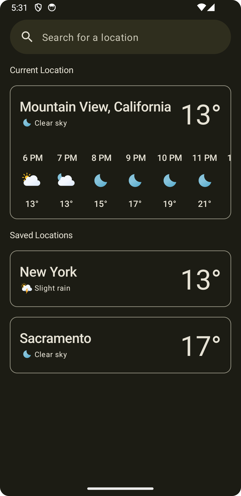

# Hi there 👋
- 💛 Tools and Technologies I love : Kotlin, Kotlin Multiplatform (KMP), TypeScript, Node.js, AWS, Docker.  
- 😄 Pronouns : he/his
- 📖 Blogs : I recently started writing technical blog posts. You can check them
  out [here](https://medium.com/@theAndroidDeveloper).

## ❤️ Languages
    

## Web 🌐 / Cloud ☁️
        

## ⚙️ Databases / IDEs / other tool & technologies 
       

## 📝 Recent Blogs

<table>

  <tr>
   <td width = "226">
     
    </td>

   <td width = "226">
     
    </td>

   <td width = "226">
     
    </td>

  </tr>

  <tr>
    <td width = "225.6" align = "center"> The #1 mistake people do when using Cloud-Firestore’s Android SDK</td>
    <td width = "225.6" align = "center"> Jetpack Compose gets official support for Marquee! Here’s how to use it!</td>
    <td width = "225.6" align = "center"> derivedStateOf() – A definitive guide on when to use it </td>

  </tr>

  <tr>
    <td width = "225.6" align = "center"> <a href = "https://medium.com/@theAndroidDeveloper/the-1-mistake-people-do-when-using-cloud-firestores-android-sdk-f855063d0a14">  Read Blog </a> </td>
    <td width = "225.6" align = "center"> <a href = "https://medium.com/@theAndroidDeveloper/jetpack-compose-gets-official-support-for-marquee-heres-how-to-use-it-1f678aecb851">  Read Blog </a> </td>
    <td width = "225.6" align = "center"> <a href = "https://medium.com/@theAndroidDeveloper/derivedstateof-a-definitive-guide-on-when-to-use-it-420985c9d296">  Read Blog </a> </td>
  </tr>

</table>

<table>
  <tr>
   <td width = "226">
      
   </td>

   <td width = "226">
      
   </td>

   <td width = "226">
      
   </td>

</tr>

  <tr> 
    <td width = "225.6" align = "center"> Displaying HTML text in Jetpack-Compose </td>
    <td width = "225.6" align = "center"> derivedStateof{} vs remember{} with keys - The difference</td>
    <td width = "225.6" align = "center"> Yet another pitfall in Jepack Compose you must be aware of</td>

  </tr>

  <tr>
    <td width = "225.6" align = "center"> <a href = "https://medium.com/@theAndroidDeveloper/displaying-html-text-in-jetpack-compose-7b801bb028c6">  Read Blog </a> </td>
    <td width = "225.6" align = "center"> <a href = "https://medium.com/@theAndroidDeveloper/derivedstateof-vs-remember-with-keys-the-difference-6d047da41bee">  Read Blog </a> </td>
    <td width = "225.6" align = "center"> <a href = "https://medium.com/@theAndroidDeveloper/yet-another-pitfall-in-jetpack-compose-you-must-be-aware-of-225a1d07d033">  Read Blog </a> </td>
  </tr>

</table>

## 🌐 Web
<table>
  <tr>
    <th> Description <th>
  </tr> 
<tr>
  <td>
    <h4> <a href = "https://wordmorning.com"> wordmorning.com </a> </h4>
    
 A fully automated daily email newsletter service aimed at improving the vocabulary of new learners of the English language.

  <ul>
    <li> AWS </li>
    <li> Docker </li>
    <li> TypeScript </li>
    <li> Node.js </li>
    <li> EJS (Embeded JavaScript) </li>
    <li> Twilio SendGrid </li>
  </ul>
  
 <a href = "https://github.com/technophilist/word-morning-readme"> > View Full Readme </a> 

  

  </td>
  <td width = "480" height = "270">
  
  </td>
  
</tr>
  </tr>
<tr>
  <td>
    <h4> Kanbas (A clone of Canvas)</h4>
    
 A simple clone of the official Canvas app. Built with React & Bootstrap.

  <ul>
    <li> React </li>
    <li> React-Icons </li>
    <li> Bootstrap </li>
    <li> TypeScript </li>
  </ul>
  <a href = "https://github.com/technophilist/kanbas-react-web-app"> > Browse Frontend Repository </a>  
  <a href = "https://github.com/technophilist/kanbas-node-server-app"> > Browse Backend Repository </a>
  </td>
  <td width = "480" height = "270">
  <!-- Surround img tag with  with link to frontend repo-->
  
  </td>
</tr>
</table>

## 💜 Kotlin Multiplatform 

<table>
  <tr>
    <th> Description <th>
  </tr> 
<tr>
  <td>
    <h4> <a href = "https://github.com/t3chkid/KMP-Notes-App"> Notes - A Kotlin Multiplatform Notes App </a> </h4>
    
Notes is a simple note taking app built with KMP(Kotlin Multiplatform), formerly known as KMM (Kotlin Multiplatform Mobile). The app is supported on both iOS and Android. The UI is written in Jetpack Compose for Android & Swift UI for IOS.

  <a href = "https://github.com/t3chkid/KMP-Notes-App"> > Browse Repository </a>
  </td>
  <td width = "480" height = "270">
  
  </td>
</tr>
</table>

## ⏱ Wear OS

| Description                                                                                                                                                                                                                                                                                                                                                                                                                          |                                                                                                                  |
|--------------------------------------------------------------------------------------------------------------------------------------------------------------------------------------------------------------------------------------------------------------------------------------------------------------------------------------------------------------------------------------------------------------------------------------|------------------------------------------------------------------------------------------------------------------|
|  
 A fun stopwatch app that uses the power of trigonometry   to create a beautiful animation while running. 
 <ul><li> Jetpack Compose for Wear OS</li><li> Canvas API (Compose)</li><li> Android Services</li><li> Flows</li><li> Coroutines</li><li> Java 8 Date/Time API</li></ul> <a href="https://github.com/t3chkid/Clocky"> > Browse Repository </a>  <a href="https://github.com/t3chkid/Clocky#tech-stack"> > View full tech stack </a> | |

## 💚 Android

<!-- To get a formatted view of the table, copy,paste the table in http://markdowntable.com -->

| Description                                                                                                                                                                                                                                                                                                                                                                                                                                                                                                                                                                                                                                                                                                                                                                                       |                                                                                                                                                                    |
|---------------------------------------------------------------------------------------------------------------------------------------------------------------------------------------------------------------------------------------------------------------------------------------------------------------------------------------------------------------------------------------------------------------------------------------------------------------------------------------------------------------------------------------------------------------------------------------------------------------------------------------------------------------------------------------------------------------------------------------------------------------------------------------------------|--------------------------------------------------------------------------------------------------------------------------------------------------------------------|
|  
 A clone of the Spotify app that makes use of the Spotify API.  This is a more sophisticated app that makes extensive use of many   API's such as the palette api for color extraction, exoplayer for media   playback and Jackson (with custom configuration) for JSON processing.   It also contains unit tests for several components. 
 <ul> <li>Hilt</li> <li>Retrofit</li><li>Paging 3</li><li>Exoplayer</li><li>Unit tests</li><li>Jackson</li><li>Palette API</li><li>Lottie compose</li> </ul>   <a href = "https://github.com/t3chkid/Musify"> > Browse repository </a>   <a href = "https://github.com/t3chkid/Musify#tech-stack"> > View full tech stack </a> |                                                               |
|  
 A fully AI powered app that allows you to point your camera   at anything and ask questions about it.   <ul> <li>Gemini Client SDK</li> <li>Preferences Datastore</li> <li>Gradle Version Catalog</li> <li>CameraX</li> <li>Themed App Icons</li>  </ul>   <a href = "https://github.com/technophilist/perceive"> > Browse repository </a>   <a href = "https://github.com/technophilist/perceive#tech-stack"> > View full tech stack </a> |                                                               |
|  
 A fully AI powered landmarks recognition app built with Gemini   Client SDK / OpenAI-API and tensorflow-lite. <ul> <li>CameraX</li> <li>Tensorflow-Lite-Task-Vision</li> <li>Gemini Client SDK</li> <li>Hilt</li> <li>Retrofit</li> <li>Themed App Icons</li>  </ul>   <a href = "https://github.com/technophilist/lookup"> > Browse repository </a>   <a href = "https://github.com/t3chkid/lookup#tech-stack"> > View full tech stack </a> |                                                               |
|  
 Arcus is a simple weather app built completely with   Jetpack Compose. Under the hood, it uses the Open-Meteo   Weather API to fetch the data. This app uses the Material 3   design system and also supports dynamic colors on supported   devices. 
 <ul> <li>OpenAI API</li> <li>Themed App Icon</li> <li>SplashScreen API</li> <li>Hilt</li> <li>Retrofit</li><li>Moshi</li><li>Unit tests</li><li>Work Manager</li><li>Room</li><li>Location Services</li></ul>   <a href = "https://github.com/t3chkid/Arcus"> > Browse repository </a>   <a href = "https://github.com/t3chkid/Arcus#tech-stack"> > View full tech stack </a>                                                                                                                      |  |
|  
 A sample app that tries to mimics the functionality of the popular Pocket app.   The main aim of this app was to test the applicability of compose in a small   sized, offline app. It was also used to assess the migration path from using   Material Design 2 to using Material Design 3 components. 
 <ul> <li> Material 3 components with dynamic colors </li> <li> Offline app </li> <li> UI fully written using compose </li> <li> Firebase authentication </li> <li> Hilt </li> <li> Workmanager </li> </ul> <a href="https://github.com/t3chkid/Pocket"> > Browse repository </a>   <a href="https://github.com/t3chkid/Pocket#tech-stack"> > View full tech stack </a> |                                                                |
|  
 Examer is an Android app that is used to take auditory tests.   It was mainly developed with the intention of using it to take tests that   evaluate a person's ability to listen to, and understand conversations   in English.
 <ul> <li> Localization </li> <li> Dokka </li> <li> Firebase Storage </li> <li> Cloud Firestore </li> <li> Workmanager </li> <li> Github Actions </li> </ul> <a href="https://github.com/t3chkid/Examer"> > Browse repository </a>   <a href="https://github.com/t3chkid/Examer#tech-stack"> > View full tech stack </a>                                                                                                                        |                                                               |
|  
 A sample pet adoption app. The aim of this app was to try out compose in   a network-centric app with realtime updates.
 <ul> <li> Realtime updates using Cloud Firestore </li> <li>  Lottie animation </li> <li> Github actions </li> <li> Coil-compose </li> </ul> <a href="https://github.com/t3chkid/Eden"> > Browse repository </a>   <a href="https://github.com/t3chkid/Eden#tech-stack"> > View full tech stack </a>                                                                                                                                                                                                                                                             |                                                                     |

## 📚 Libraries

<table>
  <tr>
    <th> Library <th>
  </tr> 
<tr>
  <td>
    <h4> Branded Buttons for Jetpack Compose </h4>
    
Branded Buttons for Jetpack Compose is a library that contains stylized buttons according to the specification of each brand. It allows you to create high quality social sign-in, sign-up, and "continue with" buttons. Just tell the library which brand and variant is required. The library takes care of creating a button with the required brand colors and logo with accessibility in mind.

  <a href = "https://github.com/t3chkid/branded-buttons-compose"> > Browse Repository </a>
  </td>
  <td width = "480" height = "270">
  
  </td>
</tr>
</table>
