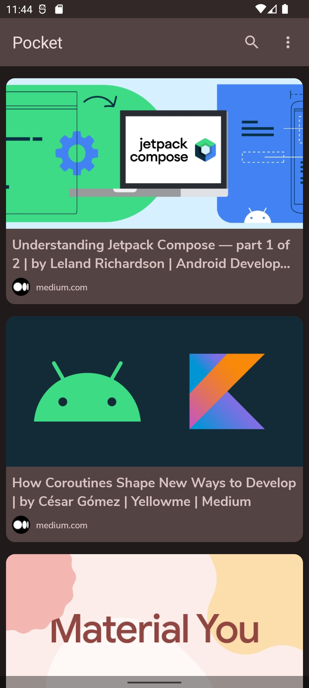

# Hi there 👋

I’m a passionate Android developer 💚 and a huge Kotlin enthusiast💜. I also have a very keen interest in software architecture 👷🏻. I was primarily a Java developer until I got to taste Kotlin.  I became an ardent fan of Kotlin the day I wrote the first line of Kotlin code. I have 2 years of experience using Kotlin. Recently I got really interested into CI and automating CI workflows 🤖. I am also a big fan of IDE’s built by Jetbrains and I’ve been working with IntelliJ and Android Studio for more than three years. I also have experience working with Firebase Authentication,Cloud Firestore and Firebase storage.

- 💛 Tools and Technologies I love : Kotlin, Jetpack compose, Coroutines , Github Actions
- 🎼 I’m currently working on a music player app.
- 👨🏻‍💻 I’m currently learning about CI and automating CI workflows with Github actions.
- 😄 Pronouns : he/his
- 🎾 Fun fact : Besides programming, I also really like to play tennis.

# 🔧 Tools/Technologies
          

# 📊 Stats

# 🔨 Projects
<!-- To get a formatted view of the table, copy,paste the table in http://markdowntable.com -->
| Project                                                                                                                                                                                                                                                                                                                                                                                                                                                                                                                                                                                        |                                                                |
|------------------------------------------------------------------------------------------------------------------------------------------------------------------------------------------------------------------------------------------------------------------------------------------------------------------------------------------------------------------------------------------------------------------------------------------------------------------------------------------------------------------------------------------------------------------------------------------------|----------------------------------------------------------------|
|  
 A clone of the Spotify app that makes use of the Spotify API.  This is a more sophisticated app that makes extensive use of many   API's such as the palette api for color extraction, exoplayer for media   playback and Jackson (with custom configuration) for JSON processing.   It also contains unit tests for several components. 
 <ul> <li>Hilt</li> <li>Retrofit</li><li>Paging 3</li><li>Exoplayer</li><li>Unit tests</li><li>Jackson</li><li>Palette API</li><li>Lottie compose</li> </ul> <i> Links will be made available once the repository is public. </i>    > Browse repository   > View full tech stack |  |
|  
 A sample app that tries to mimics the functionality of the popular Pocket app.   The main aim of this app was to test the applicability of compose in a small   sized, offline app. 
 <ul> <li> Offline app </li> <li> UI fully written using compose </li> <li> Firebase authentication </li> <li> Hilt </li> <li> Workmanager </li> </ul> <a href="https://github.com/t3chkid/Pocket"> > Browse repository </a>   <a href="https://github.com/t3chkid/Pocket#tech-stack"> > View full tech stack </a> |  |
|  
 Examer is an Android app that is used to take auditory tests.   It was mainly developed with the intention of using it to take tests that   evaluate a person's ability to listen to, and understand conversations   in English.
 <ul> <li> Localization </li> <li> Dokka </li> <li> Firebase Storage </li> <li> Cloud Firestore </li> <li> Workmanager </li> </ul> <a href="https://github.com/t3chkid/Examer"> > Browse repository </a>   <a href="https://github.com/t3chkid/Examer#tech-stack"> > View full tech stack </a> |  |
|  
 A sample pet adoption app. The aim of this app was to try out compose in   a network-centric app with realtime updates.
 <ul> <li> Realtime updates using Cloud Firestore </li> <li>  Lottie animation </li> <li> Github actions </li> <li> Coil-compose </li> </ul> <a href="https://github.com/t3chkid/Eden"> > Browse repository </a>   <a href="https://github.com/t3chkid/Eden#tech-stack"> > View full tech stack </a> |    |
